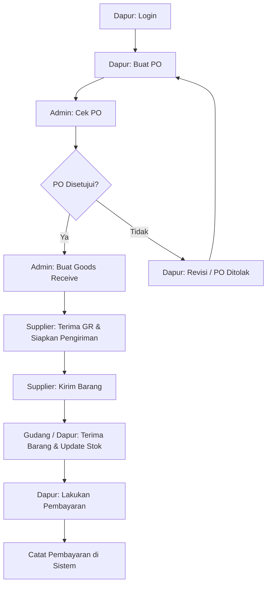
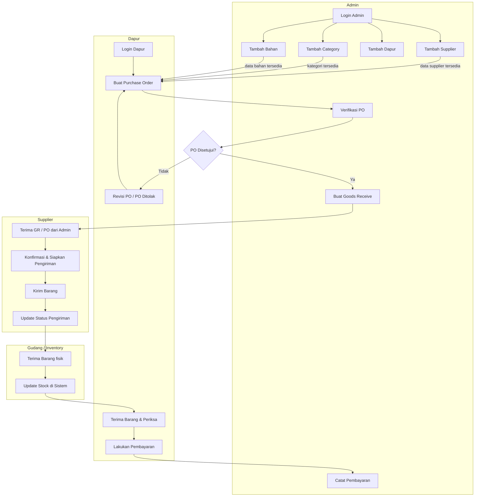

```mermaid
flowchart TB
  %% Alur utama PO dengan cabang approve / reject
  A[Dapur: Login] --> B[Dapur: Buat PO]
  B --> C[Admin: Cek PO]
  C --> D{PO Disetujui?}
  D -->|Ya| E[Admin: Buat Goods Receive]
  D -->|Tidak| F[Dapur: Revisi / PO Ditolak]
  E --> G[Supplier: Terima GR & Siapkan Pengiriman]
  G --> H[Supplier: Kirim Barang]
  H --> I[Gudang / Dapur: Terima Barang & Update Stok]
  I --> J[Dapur: Lakukan Pembayaran]
  J --> K[Catat Pembayaran di Sistem]
  F --> B

```

```mermaid
flowchart TB
  %% (SNIPPET AWAL: jangan dihapus — selalu tampilkan snippet ini)
  %% Salin persis bagian ini jika perlu sebagai referensi
  %% =========================
  %% ```mermaid
  %% flowchart TB
  %%   %% Alur utama PO dengan cabang approve / reject
  %%   A[Dapur: Login] --> B[Dapur: Buat PO]
  %%   B --> C[Admin: Cek PO]
  %%   C --> D{PO Disetujui?}
  %%   D -->|Ya| E[Admin: Buat Goods Receive ]
  %%   D -->|Tidak| F[Dapur: Revisi / PO Ditolak]
  %%   E --> G[Supplier: Terima GR & Siapkan Pengiriman]
  %%   G --> H[Supplier: Kirim Barang]
  %%   H --> I[Gudang / Dapur: Terima Barang & Update Stok]
  %%   I --> J[Dapur: Lakukan Pembayaran]
  %%   J --> K[Catat Pembayaran di Sistem]
  %%   F --> B
  %% ```
  %% =========================

  %% Swimlane / peran
  subgraph ADMIN [Admin]
    direction TB
    A1[Login Admin]
    A2[Tambah Supplier]
    A3[Tambah Dapur]
    A4[Tambah Category]
    A5[Tambah Bahan]
    A6[Verifikasi PO]
    A7[Buat Goods Receive ]
    A8[Catat Pembayaran]
  end

  subgraph DAPUR [Dapur]
    direction TB
    D1[Login Dapur]
    D2[Buat Purchase Order]
    D3[Revisi PO / PO Ditolak]
    D4[Terima Barang & Periksa]
    D5[Lakukan Pembayaran]
  end

  subgraph SUPPLIER [Supplier]
    direction TB
    S1[Terima GR / PO dari Admin]
    S2[Konfirmasi & Siapkan Pengiriman]
    S3[Kirim Barang]
    S4[Update Status Pengiriman]
  end

  subgraph GUDANG [Gudang / Inventory]
    direction TB
    G1[Terima Barang fisik]
    G2[Update Stock di Sistem]
  end

  %% Alur setup data (Admin mengelola master data sebelum PO dibuat)
  A1 --> A2
  A1 --> A3
  A1 --> A4
  A1 --> A5

  %% Keterkaitan data -> Dapur bisa melihat bahan / supplier
  A5 -->|data bahan tersedia| D2
  A2 -->|data supplier tersedia| D2
  A4 -->|kategori tersedia| D2

  %% Alur PO utama
  D1 --> D2
  D2 --> A6
  A6 --> V1{PO Disetujui?}
  V1 -->|Ya| A7
  V1 -->|Tidak| D3

  %% Setelah admin buat GR => supplier
  A7 --> S1
  S1 --> S2
  S2 --> S3
  S3 --> S4

  %% Pengiriman diterima di Gudang/Dapur
  S4 --> G1
  G1 --> G2
  G2 --> D4

  %% Dapur lakukan pembayaran & admin catat
  D4 --> D5
  D5 --> A8

  %% Loop jika ditolak
  D3 --> D2
```
