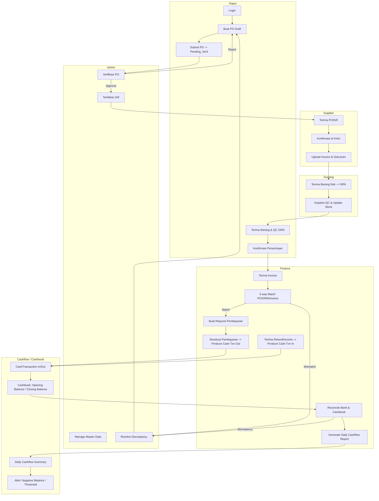

```mermaid
flowchart TB
  %% Swimlane: Dapur, Admin, Supplier, Gudang, Finance, Cashflow
  subgraph DAPUR [Dapur]
    direction TB
    D1[Login]
    D2[Buat PO Draft]
    D3[Submit PO -> Pending_Verif]
    D4[Terima Barang & QC GRN]
    D5[Konfirmasi Penerimaan]
  end

  subgraph ADMIN [Admin]
    direction TB
    A1[Manage Master Data]
    A2[Verifikasi PO]
    A3[Terbitkan GR]
    A4[Resolve Discrepancy]
  end

  subgraph SUPPLIER [Supplier]
    direction TB
    S1[Terima PO/GR]
    S2[Konfirmasi & Kirim]
    S3[Upload Invoice & Dokumen]
  end

  subgraph GUDANG [Gudang]
    direction TB
    G1[Terima Barang fisik -> GRN]
    G2[Inspeksi QC & Update Stock]
  end

  subgraph FIN [Finance]
    direction TB
    F1[Terima Invoice]
    F2[3-way Match PO/GRN/Invoice]
    F3[Buat Request Pembayaran]
    F4[Eksekusi Pembayaran -> Produce Cash Txn Out]
    F5[Terima Refund/Income -> Produce Cash Txn In]
    F6[Reconcile Bank & Cashbook]
    F7[Generate Daily Cashflow Report]
  end

  subgraph CASH [Cashflow / Cashbook]
    direction TB
    C1[CashTransaction In/Out]
    C2[Cashbook: Opening Balance / Closing Balance]
    C3[Daily Cashflow Summary]
    C4[Alert: Negative Balance / Threshold]
  end

  %% Alur utama PO -> GR -> Pengiriman -> Penerimaan -> Pembayaran
  D1 --> D2
  D2 --> D3
  D3 --> A2
  A2 -->|Approve| A3
  A2 -->|Reject| D2
  A3 --> S1
  S1 --> S2
  S2 --> S3
  S3 --> G1
  G1 --> G2
  G2 --> D4
  D4 --> D5
  D5 --> F1

  %% Finance flow & cash transactions
  F1 --> F2
  F2 -->|Match| F3
  F2 -->|Mismatch| A4
  F3 --> F4
  F4 --> C1
  F5 --> C1
  C1 --> C2
  C2 --> F6
  F6 --> F7
  F7 --> C3
  C3 --> C4

  %% Loopbacks
  A4 --> D2
  F6 -->|discrepancy| A4
```
