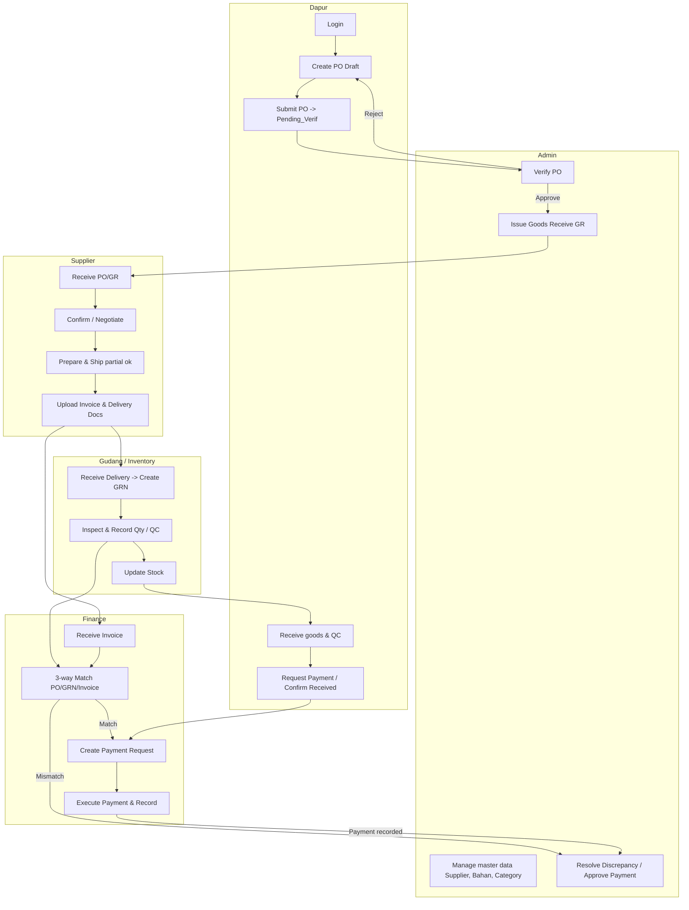

```mermaid
flowchart TB
  %% Swimlane: Dapur, Admin, Supplier, Gudang, Finance
  subgraph DAPUR [Dapur]
    direction TB
    D1[Login]
    D2[Create PO Draft]
    D3[Submit PO -> Pending_Verif]
    D4[Receive goods & QC]
    D5[Request Payment / Confirm Received]
  end

  subgraph ADMIN [Admin]
    direction TB
    A1[Manage master data Supplier, Bahan, Category]
    A2[Verify PO]
    A3[Issue Goods Receive GR]
    A4[Resolve Discrepancy / Approve Payment]
  end

  subgraph SUPPLIER [Supplier]
    direction TB
    S1[Receive PO/GR]
    S2[Confirm / Negotiate]
    S3[Prepare & Ship partial ok]
    S4[Upload Invoice & Delivery Docs]
  end

  subgraph GUDANG [Gudang / Inventory]
    direction TB
    G1[Receive Delivery -> Create GRN]
    G2[Inspect & Record Qty / QC]
    G3[Update Stock]
  end

  subgraph FIN [Finance]
    direction TB
    F1[Receive Invoice]
    F2[3-way Match PO/GRN/Invoice]
    F3[Create Payment Request]
    F4[Execute Payment & Record]
  end

  %% Flow connections
  D1 --> D2
  D2 --> D3
  D3 --> A2
  A2 -->|Approve| A3
  A2 -->|Reject| D2
  A3 --> S1
  S1 --> S2
  S2 --> S3
  S3 --> S4
  S4 --> G1
  G1 --> G2
  G2 --> G3
  G3 --> D4
  G2 --> F2
  S4 --> F1
  F1 --> F2
  F2 -->|Match| F3
  F2 -->|Mismatch| A4
  F3 --> F4
  F4 -->|Payment recorded| A4
  D4 --> D5
  D5 --> F3
```
